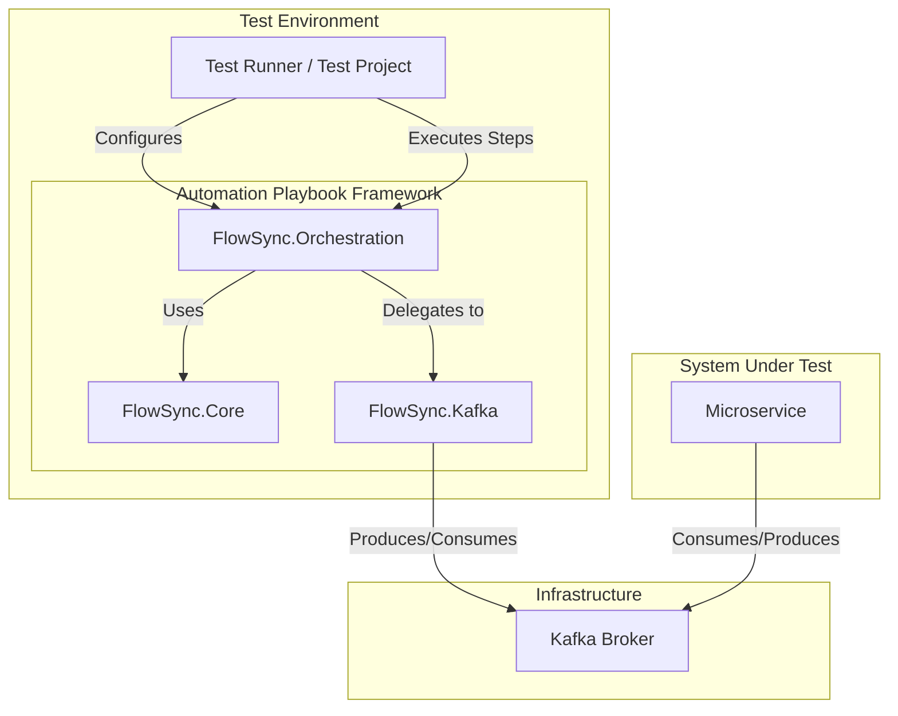
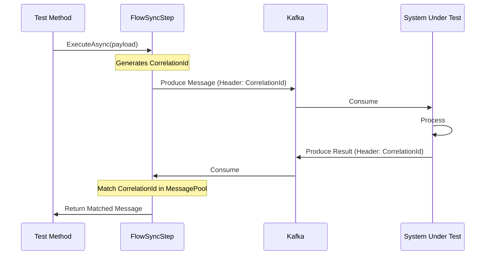
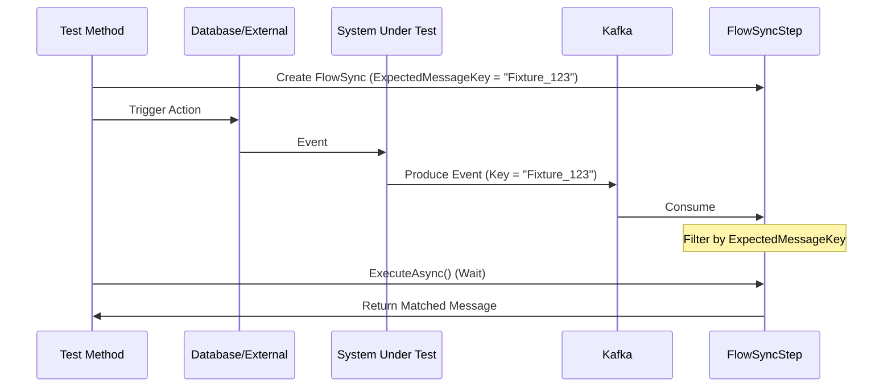

# Automation Playbook Framework - High Level Design (HLD)

## 1. Executive Summary

The **Automation Playbook** is a robust, reusable .NET infrastructure library designed to standardize and simplify integration and automation testing for microservices. It abstracts the complexities of Kafka messaging, dependency injection, and test orchestration, allowing QA and developers to focus on writing test logic rather than maintaining boilerplate infrastructure.

## 2. Architecture Overview

The framework operates as a middleware layer between the Test Runner (e.g., xUnit/NUnit) and the System Under Test (SUT) infrastructure (primarily Kafka).

## 3. Core Components

The solution is divided into three main logical layers:

### 3.1 FlowSync.Core (Abstractions)
The foundational layer defining interfaces and domain models.
*   **Responsibilities**: Defines `IMessagePool`, `IFilterService`, and core Messaging interfaces.
*   **Key Abstractions**: Interface definitions for Receivers, Publishers, and Filtering logic independent of the underlying transport (Kafka).

### 3.2 FlowSync.Kafka (Implementation)
The concrete implementation layer specifically for Apache Kafka.
*   **Responsibilities**: Wraps `KafkaFlow` and `Confluent.Kafka` to provide easy-to-use builders and clients.
*   **Key Features**:
    *   **Builders**: `KafkaBrokerConfigurationBuilder`, `KafkaConsumerConfigurationBuilder` for fluent setup.
    *   **Serializers**: Support for JSON (`KafkaUTF8Serializer`) and Protobuf (`KafkaProtobufSerializer`).
    *   **Middleware**: Custom error handling and message filtering middleware.

### 3.3 FlowSync.Orchestration (Flow Control)
The "brain" of the framework that manages the test lifecycle.
*   **Responsibilities**: Synchronizes the asynchronous nature of messaging with the synchronous nature of tests.
*   **Key Components**:
    *   **`IFlowSyncFactory`**: Creates initialized `FlowSyncStep` instances.
    *   **`FlowSyncStep`**: Represents a single test action (Produce -> Wait -> Consume).
    *   **`MessagePool`**: A thread-safe collection holding consumed messages until requested by the test.

## 4. Key Design Patterns

*   **Builder Pattern**: Used extensively for configuration (e.g., `.AddKafkaFlowSync(builder => ...)`), allowing fluent and readable setup of complex Kafka topologies.
*   **Factory Pattern**: `FlowSyncFactory` abstracting the creation of FlowSync steps, ensuring all dependencies (like `IMessagePool`) are correctly injected.
*   **Strategy Pattern**: Used for Serialization (switching between UTF8/Protobuf) and Correlation (switching between Auto-CorrelationId and ExpectedMessageKey).

## 5. Operational Workflows

### 5.1 Producer-Driven Flow (Active)
Used when the test initiates the action by sending a command message.

### 5.2 MessageKey Flow (Passive — Filter by Key)
Used when consuming messages by their Kafka message key instead of a correlationId. The trigger can be anything — a DB update, an external API call, a broadcast, or any event that produces a Kafka message with a known, predictable key.

## 6. Configuration & Infrastructure

The framework integrates natively with .NET Core `IConfiguration` and `IServiceCollection`.

*   **Dependency Injection**: All components are registered via `services.AddKafkaFlowSync()`.
*   **Configuration Sources**: Supports `appsettings.json`, Environment Variables, and Placeholder resolution (Steeltoe) for secret management.
*   **Consumer Groups**: Tests dynamically create and (crucially) **must clean up** consumer groups to ensure test isolation and repeatability.

## 7. Technology Stack

*   **Runtime**: .NET 6/8
*   **Messaging**: `Confluent.Kafka`, `KafkaFlow`
*   **Configuration**: `Microsoft.Extensions.Configuration`, `Steeltoe.Extensions.Configuration.Placeholder`
*   **Logging**: `Serilog`, `Microsoft.Extensions.Logging`

